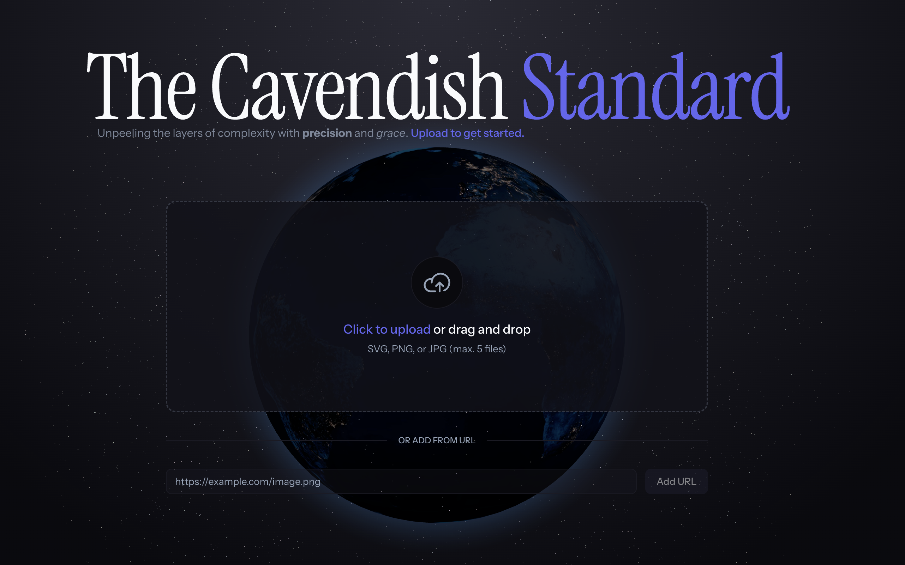
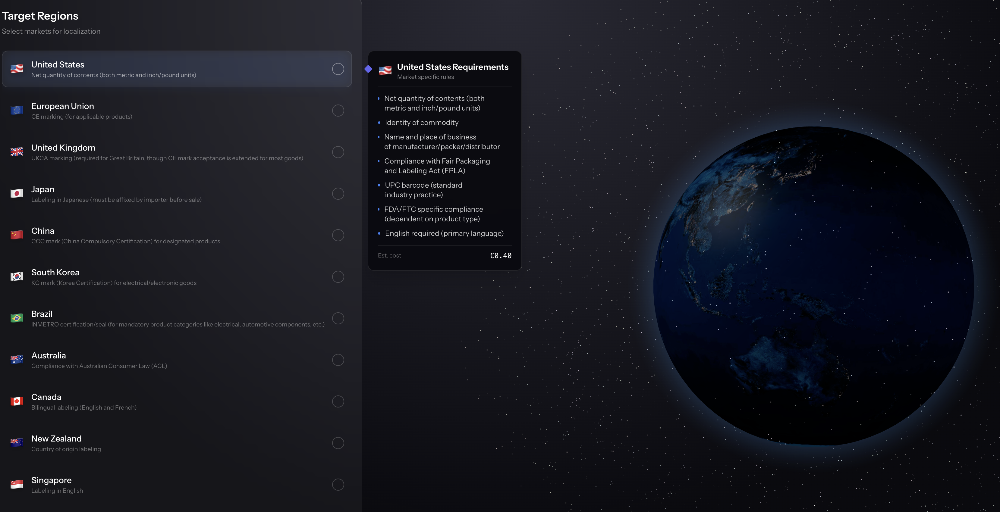
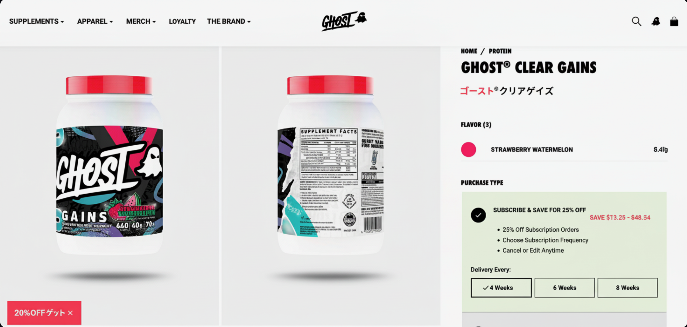

### Team Name

The Cavendishes

### Team Members

- Cooper Oliff
- Otto Cline

### Demo

- **Live URL:** <https://ecomm-hacks-starter-production.up.railway.app/>
- **Demo Video:** [YouTube/Loom link if applicable]

### What We Built

We built a tool that makes localization and compliance easy in international markets. Upload any storefront image(s) or paste a URL to a product page and we'll analyze it and generate a localized version for you for 10+ regions.

### How It Works

### Key Features

- Smooth and intuitive UI with <1mb bundle.
- Exposes easy API endpoints at every step of the process.
- All data is hosted and able to be retrieved by the user at any time.

### Tech Stack

- **Frontend:** Svelte + Tailwind + Shadcn UI + Phosphor Icons + ThreeJS + Tanstack Query
- **Backend:** Bun + Prisma + PostgreSQL + Railway
- **Models:** Gemini 3 Pro, Nano Banana Pro
- **Other:** Fully TypeSafe, self-hostable, and fully safe from data leaks.

### Setup Instructions

```bash
# Make sure you have bun installed (http://bun.sh/)

# Install dependencies
bun install

# Run the development server
bun dev
```

### Screenshots





### Challenges We Faced

Difficultly managing the flow of processing, storing, and retrieving data from the database in a fullstack application.
But it means you could self host without risk of data leaks.

### What's Next

Individual label generation, better compliance database, and more regions.
